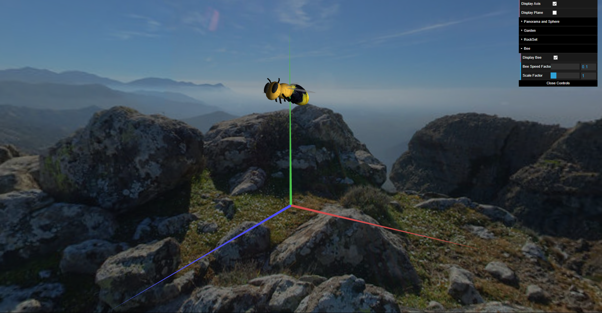

# CG 2023/2024

## Group T07G03
| Name             | Number    |
| ---------------- | --------- |
| José Martins     | 202108794 |
| Tomás Martins    | 202108776 |

## Instructions

| Control Key | Description |
| ----------- | ----------- |
| W           | Accelerate |
| A           | Turn Bee left |
| D           | Turn Bee right |
| S           | Brake |
| F           | Make the Bee descend to pick a pollen |
| P           | Make the Bee ascend after descending |
| O           | Transport the pollen to the hive after picking a pollen |
| R           | Restart the Bee position and velocity to the original one |

# Description

More detailed information about the project can be found in the documentation in the files.

## 1. SkySphere

### 1.1 Sphere Creation

The Sphere was used for more than just the panorama. To do that, we added some more parameters to the sphere creation function. It receives the number of slices and stacks, if it is inverted or not, the radius of the sphere and the texture to be applied.
It was hard to make the sphere look like a sphere, with the desired slices and stacks, but after it was done, it was easy to do the rest of the sphere.

### 1.2 Panorama
The panorama is a sphere with a texture that is applied to it. The texture is a panorama of a sky that is applied to the sphere. The sphere is placed in the center of the scene and the camera is placed inside the sphere, so the panorama is always visible.

## 2. Flowers

### 2.1 Flower Model

The Flower model is composed by the following parts:
- Petal
- Stem
- Leaves
- Receptacle
- Pollen

#### 2.1.1 Petal

Petal model is composed by two triangles that are united by their bases and form an angle between them.

#### 2.1.2 Stem

The stem is composed by numerous cylinders with oblique sides that are united by their bases. Between each cylinder there is a leaf.

#### 2.1.3 Leaves

The leaves are composed by two triangles with a cylinder in the middle that works as an extension of the stem.

#### 2.1.4 Receptacle

The receptacle is a sphere that is placed on top of the stem and is the base of the petals.

#### 2.1.5 Garden

The garden is composed by a matrix of flowers objects.

### 2.2 Randomness on flower generation

The flower ans its components are randomly generated. The following parameters are randomly generated:

- Number of petals
- Colour of the petals
- Radius of the flower's heart
- Stem cylinder radius
- Stem size (number of stem cylinders)
- Cylinders of stem height
- Angles necessaries

### Screenshots

## 3. Rocks and boulders

### 3.1 Rock Modelation

Each rock is a sphere with random scaling, with a texture applied to it. It was easy to make the rocks, since it was just a sphere with a texture applied to it.

### 3.2 Boulder Modelation

A boulder is a pyramid of rocks. On the top of the pyramid, there is a hive. The boulder is composed by a matrix of rocks objects.

### Screenshots

![]

## 4. Bee

### 4.1 Bee Model

The Bee model is composed by the following parts:
- Abdomen
- Torax
- Wings
- Head

#### 4.1.1 Abdomen and Torax

The abdomen and torax are composed by two enlongated spheres to form the body of the Bee.

#### 4.1.2 Head

The head is composed by a sphere that is placed on top of the torax and is the base of the antennas and eyes.

#### 4.1.3 Legs and antennaes

The legs and antennaes are composed by cylinders that are placed on the head and torax.

#### 4.1.4 Wings

The wings are composed by like a scaled down enlongated sphere that is placed on the torax.

### 4.2 Animation

The Bee has a simple animation that makes it move forward and rotate. Also it is able to descend and ascend to pick up pollen and transport it to the hive. The bee movement is represented by a parabolic movement.

### Screenshots

## 5. Polen e Colmeia

### 5.1 Modelação do Polen

### 5.2 Modelação da Colmeia

### 5.3 Controlo da abelha

## 6. Shaders e Animação

### 6.1 Relva

### 6.2 Shaders

## 7. Desenvolvimentos adicionais

