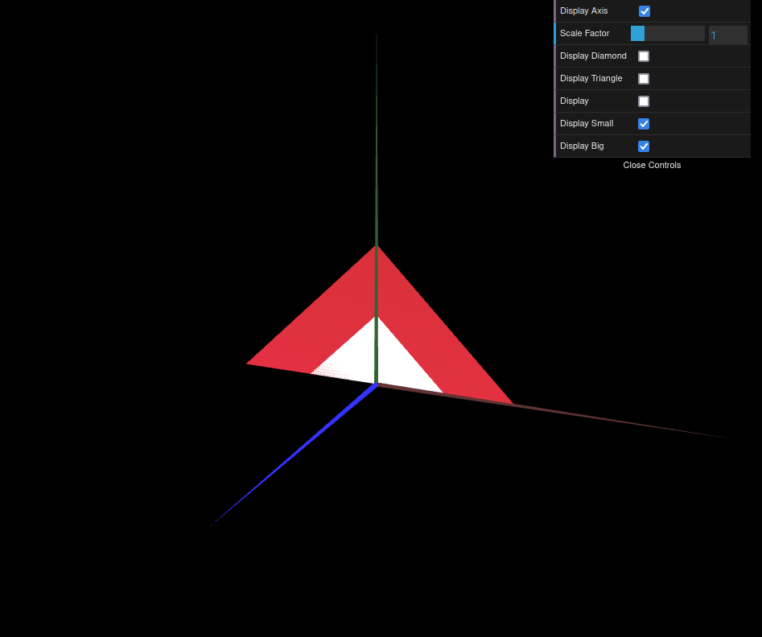

# CG 2023/2024

## Group T0xG0y

## TP 1 Notes

For this first TP, we simply had to draw some objects. The main goal and also the main challenge was to understand how could we create our objects using simple triangles. 

Since we had to create 5 objects, we will start by explaining what was the process of adding each one of them to the scene, and then we will show how we created each one of them.

### Adding the objects to the scene

To add the objects to the scene, we first had to create a file for each one of them. After creating the vertexes and the indexes of the object, we had to import the object to `MyScene.js`, where we would create the object and add it to the scene.

To do this we had to: 
- Initialize the object in the  `init` function;
- Call the `display` method of the object in the `display` function;

### Creating the objects

#### Object 1 - Triangle

Since the triangle is the simplest object, it was the perfect object to understand the process of organizing the vertexes and the indexes of the object. 
First we had to create the vertexes of the object, simply by creating a list of points.
But the indexes were a bit more complicated. And have became the main challenge of the TP. Simply putting the vertexes in a random order would not work. We had to understand how to create the indexes in a way that would create the triangles in the correct order. For this we had to understand the concept of the winding order, which refers to the sequence in which vertices are linked to form triangles. Since the professor explained it in class, it was not that hard to understand how to create the indexes of the object, but it was also a necessary step to understand how to create the other objects. This order just says that the vertexes of the triangles must be in a clockwise order, so that we can see the front of the object.
After ordering the vertexes and the indexes, we had the triangle.

#### Object 2 - Double-sided Parallelogram

After understanding how to create the indexes of the object, we had no problem creating the double-sided parallelogram. We just had to create the vertexes and the indexes in a way that would create the triangles in the correct order.
When we look at a parallelogram, we can see that it is composed by two triangles. So, we just had to display the two triangles in the correct order, and we would have the parallelogram. 
The tricky part here was that the parallelogram is double-sided. But since the document of the TP had a hint about this, we easily understood that we just had to add new indexes in a clockwise order, and we would have the double-sided parallelogram. 

#### Object 3 and 4 - Small and Big Triangle

This two objects were easy to create, since we already knew how to create the indexes of the object. We just had to create the vertexes and the indexes in a way that would create the triangles in the correct order.

### Modifying the interface

It was also necessary to modify the interface, so that we could change what objects were being displayed. First we had to create the objects in the `init` function, that would simply be a boolean that would be true if the object was being displayed, and false if it was not. Then we had to add a new button in `MyInterface.js` that would change the value of the boolean. 
Having this buttons, we just added a new `if` statement in the `display` function, that would call the `display` method of the object if the boolean was true.

### Conclusion

This TP was a good introduction to the course, since it was a good way to understand how to create the objects and how to add them to the scene. We didn't have much trouble doing it, and we were able to understand the concepts that were being taught in class.

### Screenshots

