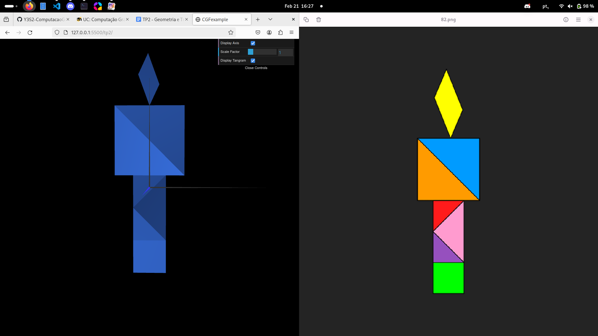

# CG 2023/2024

## Group T07G03

## TP 2 Notes

### Exercice 1

For this exercice, we were asked to apply geometric transformations to the previous created objects in order to create a Tangram.

#### Using matrixes to apply transformations

To accurately position and orient the Tangram, we utilized a transformation matrix involving rotation and translation applied to the initial object, `MyDiamond`. Initially, a rotation matrix was applied, rotating the object by 45 degrees. Following the rotation, a translation was performed, shifting the object downwards by 3 units along the y-axis. This process ensured the correct placement and orientation of the Tangram on the scene.

```javascript
const deg2rad = Math.PI / 180;    
  
const cos_a = Math.cos(45.0*deg2rad);
const sin_a = Math.sin(45.0*deg2rad);
  
this.scene.pushMatrix();

this.scene.multMatrix([
  cos_a, -sin_a, 0,0,
  sin_a, cos_a, 0,0,
  0, 0, 1, 0,
  0, -3, 0, 1
]);
```

#### Placing the rest of the Tangram

After positioning the first object, we proceeded to place the remaining pieces in the scene using geometric transformation methods outlined in section 2. To achieve this, we employed the `translate`, `rotate`, and `scale` methods to accurately position and orient each object. Additionally, we utilized the `pushMatrix` and `popMatrix` methods to isolate and control the transformations applied to each object. These methods ensured that transformations were only applied to the desired objects while maintaining the origin as the reference point for each transformation. This approach facilitated precise placement and orientation of the Tangram pieces within the scene.
An example of the code used to place the rest of the Tangram is shown below:

```javascript
this.diamond.display();
this.scene.pushMatrix();
this.scene.rotate(45.0*deg2rad, 0, 0, 1);
this.scene.scale(1/Math.sqrt(2), 1/Math.sqrt(2),1);    this.scene.translate(0,2,0);
this.trianglePurple.display();
this.scene.popMatrix();
this.scene.pushMatrix();
this.scene.scale(Math.sqrt(2), Math.sqrt(2),1);
this.scene.rotate(135.0*deg2rad,0,0,1);
this.scene.translate(1.5,-0.5,0);
this.trianglePink.display();
this.scene.popMatrix();
this.scene.pushMatrix();
this.scene.rotate(-45.0*deg2rad, 0, 0, 1);
this.scene.scale(1/Math.sqrt(2), 1/Math.sqrt(2),1);
...
```

#### Creating the Tangram class

After building the Tangram, we created a class to encapsulate the Tangram's objects and transformations. This class was designed to facilitate the creation and display of the Tangram within the scene. The class contained methods to create and display each object, as well as methods to apply the necessary transformations to position and orient the Tangram within the scene. This approach provided a modular and organized way to manage the Tangram, allowing for easy integration and manipulation within the scene.

### Conclusion

This TP was a good introduction to the course, since it was a good way to understand how to create the objects and how to add them to the scene. We didn't have much trouble doing it, and we were able to understand the concepts that were being taught in class.

### Screenshots

