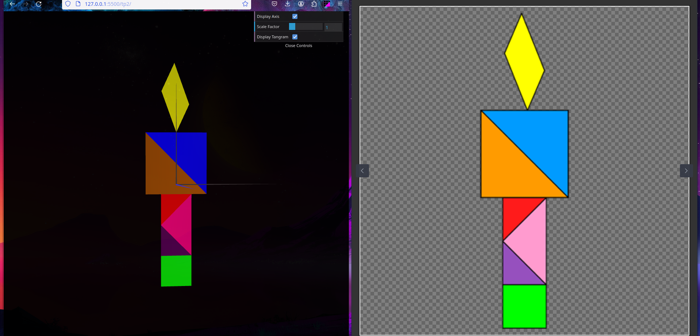

# CG 2023/2024

## Group T07G03

## TP 2 Notes

### Exercise 1

For this exercise, we were asked to apply geometric transformations to the previous created objects in order to create a Tangram.

#### Using matrixes to apply transformations

To accurately position and orient the Tangram, we utilized a transformation matrix involving rotation and translation applied to the initial object, `MyDiamond`. Initially, a rotation matrix was applied, rotating the object by 45 degrees.
Following the rotation, a translation was performed, in order to approximately center the final tangram in the scene. For this, we aligned the bottom of the diamond with the origin of the scene. Then, we calculated the height of the full tangram: 

- Diamond: Square root of 2
- Big Square made by the two big triangles: Square root of 8
- Rectangle: 2 * Square root of 2 (that is the height of the small triangle)
- Parallellogram: approximately 3. When the bottom side of the parallelogram is aligned with the y-axis, his height is 3. We cannot calculate the exact height of the parallelogram, but we know that it is a bit bigger than 3. 

Finally, we added this height to the y-axis translation, and we got it almost centered in the scene. This process ensured the correct placement and orientation of the Tangram on the scene.

```javascript
const deg2rad = Math.PI / 180;    
  
const cos_a = Math.cos(45.0*deg2rad);
const sin_a = Math.sin(45.0*deg2rad);
const Ty = - (3 + Math.sqrt(8) + Math.sqrt(2)*2 + Math.sqrt(2) )/2 + Math.sqrt(2)/2;

  
this.scene.pushMatrix();

this.scene.multMatrix([
  cos_a, -sin_a, 0,0,
  sin_a, cos_a, 0,0,
  0, 0, 1, 0,
  0, Ty, 0, 1
]);
```

#### Placing the rest of the Tangram

After positioning the first object, we proceeded to place the remaining pieces in the scene using geometric transformation methods outlined in section 2. To achieve this, we employed the `translate`, `rotate`, and `scale` methods to accurately position and orient each object. Additionally, we utilized the `pushMatrix` and `popMatrix` methods to isolate and control the transformations applied to each object. These methods ensured that transformations were only applied to the desired objects while maintaining the origin as the reference point for each transformation. This approach facilitated precise placement and orientation of the Tangram pieces within the scene.
An example of the code used to place the rest of the Tangram is shown below:

```javascript
this.diamond.display();
this.scene.pushMatrix();
this.scene.rotate(45.0*deg2rad, 0, 0, 1);
this.scene.scale(1/Math.sqrt(2), 1/Math.sqrt(2),1);    
this.scene.translate(0,2,0);
this.trianglePurple.display();
this.scene.popMatrix();
this.scene.pushMatrix();
this.scene.scale(Math.sqrt(2), Math.sqrt(2),1);
this.scene.rotate(135.0*deg2rad,0,0,1);
this.scene.translate(1.5,-0.5,0);
this.trianglePink.display();
this.scene.popMatrix();
this.scene.pushMatrix();
this.scene.rotate(-45.0*deg2rad, 0, 0, 1);
this.scene.scale(1/Math.sqrt(2), 1/Math.sqrt(2),1);
...
```

#### Creating the Tangram class

After building the Tangram, we created a class to encapsulate the Tangram's objects and transformations. This class was designed to facilitate the creation and display of the Tangram within the scene. The class contained methods to create and display each object, as well as methods to apply the necessary transformations to position and orient the Tangram within the scene. This approach provided a modular and organized way to manage the Tangram, allowing for easy integration and manipulation within the scene.



### Exercise 2

#### Using the cube as the tangram base

In this exercise we built a cube centered at the origin, by indicating the 8 vertexes of the cube and corresponding indices to form the faces. We then applied some transformations to the cube in order to put it besides the tangram to use it as a 'base'. After that a `rotation` and `translation` were applied to the cube to position the set (cube and tangram) parallel to the XZ plane with the upper left vertex of the base cube at the origin.


### Exercise 3

#### Creating the cube with a single MyQuad object

In this exercise, instead of creating the cube by indicating the 8 vertexes and the corresponding indices to form the faces, we created a new class called MyQuad, that only creates a single unitary square. Then, instead of a complex object with a lot of vertexes and indices, we created a cube by displaying a single MyQuad object 6 times, and applying the necessary transformations to position and orient the cube within the scene. It's a different approach to create the cube, and we liked it better than the previous one.
In the end, we applied the same transformations to the cube and to the tangram, to have them in the same position as in the previous exercise.


### Conclusion

This TP was a lot of fun to do, and it was a bit harder than the previous one. We learned a lot about transformations, and how to apply them to objects in the scene. 
Creating the Tangram was a bit tricky, but we managed to do it. We also understood the importance of creating classes to encapsulate objects and transformations, and how it can make the code more organized and easier to understand.
Finally, we learned that there are different ways to create the same object, and that we should always try to find the best way to do it. In this TP, we found a better way to create the cube, and we are happy with the result.
