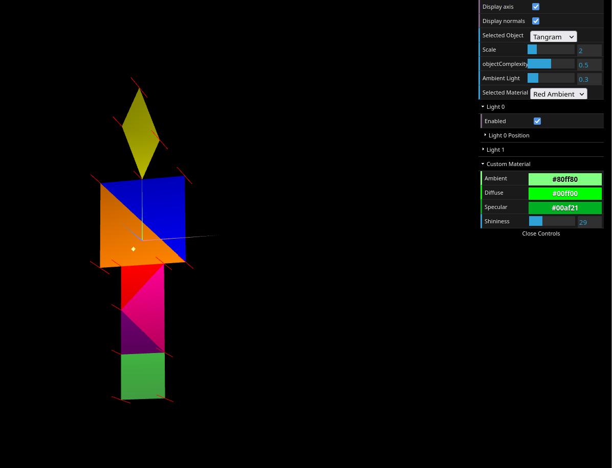
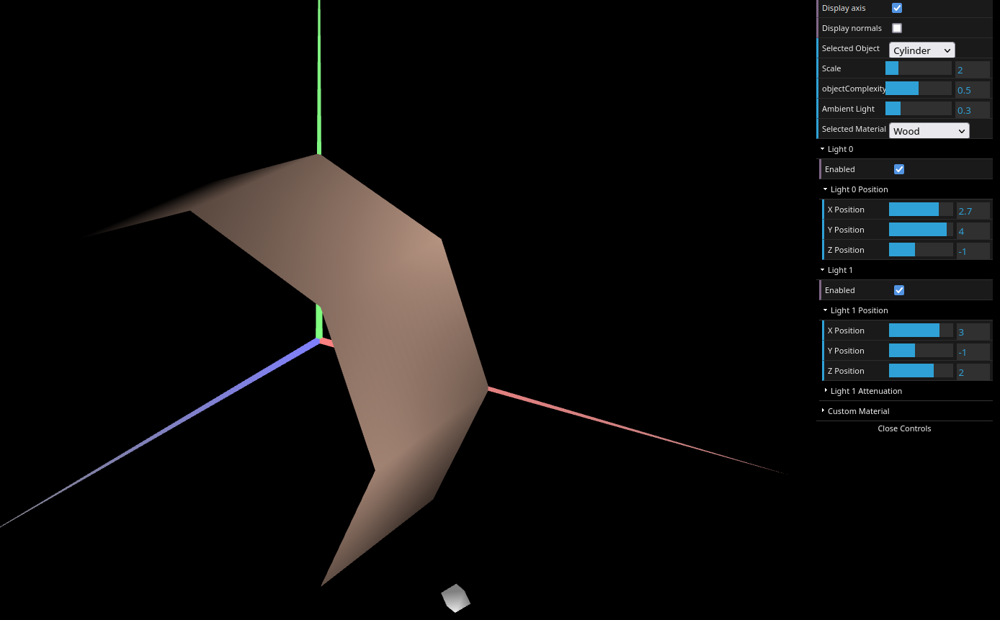

# CG 2023/2024

## Group T07G03

## TP 3 Notes

### Exercise 1

- Integrated Tangram and cube objects with custom materials.
- Defined normal vectors for realistic lighting effects.
- Created a wood-like material.
- Applied high-specular materials to Tangram parts.
- Used 'Custom' material for the Tangram's diamond piece.

Since we had already added the materials to the Tangram object, this exercise was relatively straightforward. 
The main challenge was to define the normal vectors for the Tangram object. We had to define the normal vectors for each face of the Tangram object, which was a bit time-consuming.
This exercise was a good opportunity to experiment with different materials and lighting effects, and to understand how they really work.

### Exercise 2

- Developed a multi-sided prism model with adjustable floors.
- Experimented with normal vectors and lighting effects.
- Compared results with "Constant Shading."

This exercise was a bit more challenging than the previous one. We had to define the normal vectors for each face of the prism, which was time-consuming. We also had to define the vertices for each face of the prism, which was also time-consuming.
We decided to define the vertices for each face, creating all the stacks, using a for loop, which made the code more efficient. We also defined the normal vectors for each face, using a for loop, which also made the code more efficient. 
The main challenge was to define the indices for each face of the prism, which was time-consuming. We had to understand how could we calculate the indices for each face of the prism and define them in a for loop. 

### Exercise 3

- Created a cylindrical model based on prism code.
- Modified normal vectors for a smoother, curved appearance.
- Simplified vertices and normals for efficiency.
- Confirmed that lighting transitions are smoother, better suggesting a curved surface.

Since we had already developed the prism model, this exercise was relatively straightforward. Even the normals were easier to define. 
The only challenge was to define the indices for the cylinder, which was time-consuming. Once more, we had to understand how could we calculate the indices for each face of the cylinder, since the order of the vertices was different from the prism.
It was also a good opportunity to understand that the normals define the lighting effects, taking the user to believe that the surface is curved, even though it is not.

### Screenshots

