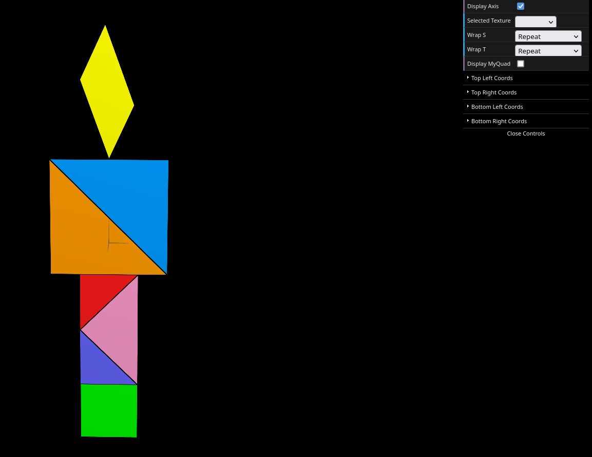
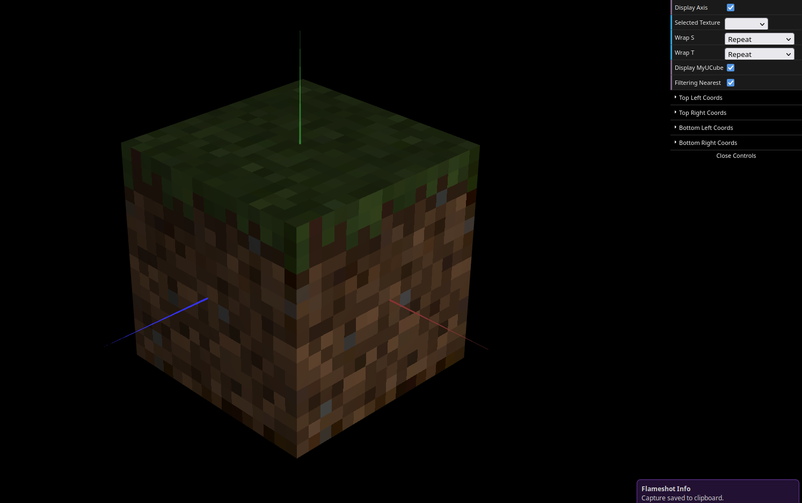

# CG 2023/2024

## Group T07G03

## TP 4 Notes

The first task we had was to convert the materials we had created in the previous labs into textures, loaded from a given image `tangram.png`. This step proved to be quite straightforward, without encountering any major issues. We simply needed to grasp that the coordinates (s, t) of a texture range from 0 to 1, and then determine how to map these coordinates onto our vertices.

Next, we proceeded to utilize the `MyUnitCubeQuad` from tp2 and assign a different texture to each quad. This proved to be a bit more challenging, given the various approaches available. Initially, we created a new material and assigned it to each new face. While this approach worked initially, we encountered a setback when attempting to alter the used filter.

We learned that, by default, textures utilize linear filtering, which simply selects a literal color from a pixel. This resulted in "ugly" textures. Despite our textures being designed to cover 16x16 pixels, they were appearing significantly larger. To rectify this, we implemented a function `chooseFilter()` to determine the filtering method based on a checkbox input.

However, we encountered an issue where the filtering method for the last texture wasn't being properly adjusted. After extensive troubleshooting, we opted to change the approach to how the textures were loaded and applied. We removed the previously created material and instead directly bound the textures using `bind()` for each texture, which resolved the issue flawlessly.

Finally, we achieved a much improved appearance for our Minecraft dirt block.

## Screenshots

