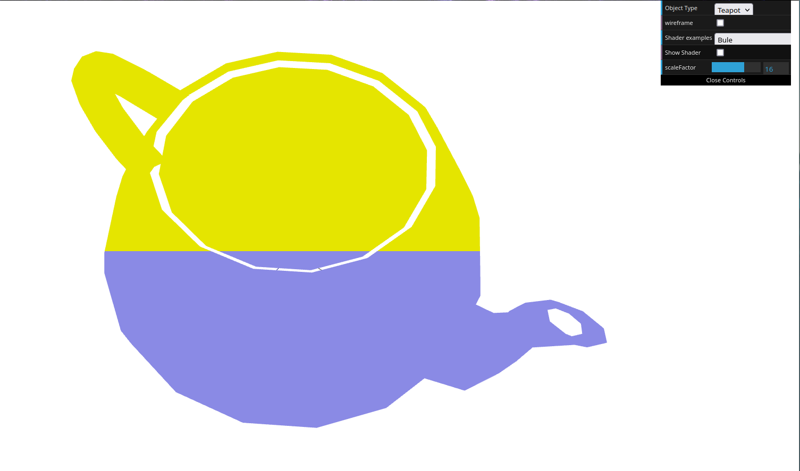
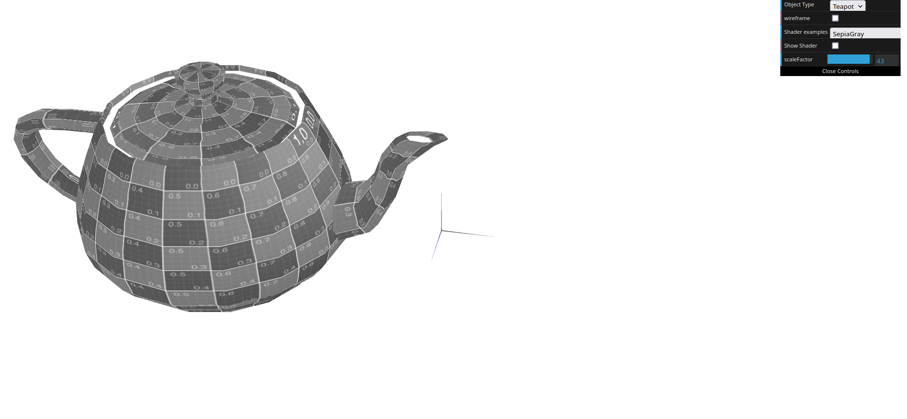
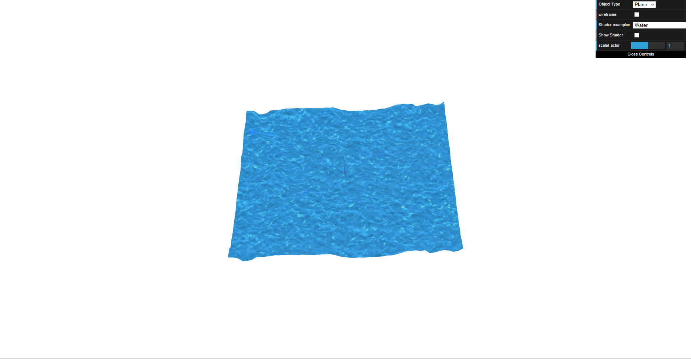

# CG 2023/2024

## Group T07G03

## TP 5 Notes

For the first task we had to create new vertex and fragment shaders in order to make the teapot have the upper half coloured yellow and the lower half coloured blue. For this, we created a `bue.frag` and `bue.vert` file where we defined that when the `y` coords of the vertex were greater or equal to 0.5, the color would be yellow, otherwise it would be blue.

For the second task we implemented a shader that animates objects along the X-axis with a `sinusoidal effect`. The wave's intensity is controlled by a scaleFactor accessible from the interface. Additionally, we implemented a shader that paints the teapot with a grayscale based on the `sepia shader`.

For the third and last task we applied a `water` texture with shaders to the plane object. In order to create a sensation of texture and water-like effect the texture coordinates were animated following the `colour component` of the texture. Then, adding a time variable to the texture coordinates, we were able to create the desired effect.

## Screenshots

